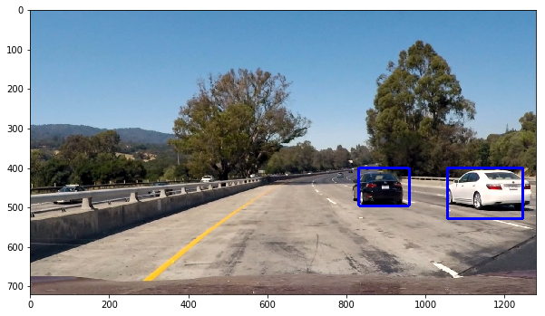

# Vehicle Detection Project Writeup

The goals / steps of this project are the following:

- Perform a Histogram of Oriented Gradients (HOG) feature extraction on a labeled training set of images and train a classifier Linear SVM classifier
- Optionally, you can also apply a color transform and append binned color features, as well as histograms of color, to your HOG feature vector. 
- Note: for those first two steps don't forget to normalize your features and randomize a selection for training and testing.
- Implement a sliding-window technique and use your trained classifier to search for vehicles in images.
- Run your pipeline on a video stream (start with the test_video.mp4 and later implement on full project_video.mp4) and create a heat map of recurring detections frame by frame to reject outliers and follow detected vehicles.
- Estimate a bounding box for vehicles detected.

Check out the project website here: https://codynicholson.github.io/Vehicle_Detection/

[//]: # (Image References)
[image1]: ./examples/car_not_car.png
[image2]: ./examples/HOG_example.jpg
[image3]: ./examples/sliding_windows.jpg
[image4]: ./examples/sliding_window.jpg
[image5]: ./examples/bboxes_and_heat.png
[image6]: ./examples/labels_map.png
[image7]: ./examples/output_bboxes.png
[video1]: ./project_video.mp4

---

### Histogram of Oriented Gradients (HOG)

#### 1. Explain how (and identify where in your code) you extracted HOG features from the training images

This is the code I used for this step that is contained in the first and forth code cell of the IPython notebook:

##### First Code Cell:

```python
def get_hog_features(img, orient, pix_per_cell, cell_per_block, 
                        vis=False, feature_vec=True):
    # Call with two outputs if vis==True
    if vis == True:
        features, hog_image = hog(img, orientations=orient, 
                                  pixels_per_cell=(pix_per_cell, pix_per_cell),
                                  cells_per_block=(cell_per_block, cell_per_block), 
                                  transform_sqrt=False, 
                                  visualise=vis, feature_vector=feature_vec)
        return features, hog_image
    # Otherwise call with one output
    else:      
        features = hog(img, orientations=orient, 
                       pixels_per_cell=(pix_per_cell, pix_per_cell),
                       cells_per_block=(cell_per_block, cell_per_block), 
                       transform_sqrt=False, 
                       visualise=vis, feature_vector=feature_vec)
        return features

def extract_features(imgs, cspace='RGB', orient=9, 
                        pix_per_cell=8, cell_per_block=2, hog_channel=0):
    # Create a list to append feature vectors to
    features = []
    # Iterate through the list of images
    for i in imgs:
        # print file index
        print(i)
        # Read in each one by one
        image = mpimg.imread(i)
        # apply color conversion if other than 'RGB'
        if cspace != 'RGB':
            if cspace == 'HSV':
                feature_image = cv2.cvtColor(image, cv2.COLOR_RGB2HSV)
            elif cspace == 'LUV':
                feature_image = cv2.cvtColor(image, cv2.COLOR_RGB2LUV)
            elif cspace == 'HLS':
                feature_image = cv2.cvtColor(image, cv2.COLOR_RGB2HLS)
            elif cspace == 'YUV':
                feature_image = cv2.cvtColor(image, cv2.COLOR_RGB2YUV)
            elif cspace == 'YCrCb':
                feature_image = cv2.cvtColor(image, cv2.COLOR_RGB2YCrCb)
        else: feature_image = np.copy(image)

        # Call get_hog_features() with vis=False, feature_vec=True
        if hog_channel == 'ALL':
            hog_features = []
            for channel in range(feature_image.shape[2]):
                hog_features.append(get_hog_features(feature_image[:,:,channel], 
                                    orient, pix_per_cell, cell_per_block, 
                                    vis=False, feature_vec=True))
            hog_features = np.ravel(hog_features)        
        else:
            hog_features = get_hog_features(feature_image[:,:,hog_channel], orient, 
                        pix_per_cell, cell_per_block, vis=False, feature_vec=True)
        # Append the new feature vector to the features list
        features.append(hog_features)
    # Return list of feature vectors
    return features
```

##### Forth Code Cell:

```python
# Get Sample Images
car_img = mpimg.imread(car_images[0])
not_car_img = mpimg.imread(noncar_images[0])

# Get HOG features from images
_, car_dst = get_hog_features(car_img[:,:,2], 9, 8, 8, vis=True, feature_vec=True)
_, not_car_dst = get_hog_features(not_car_img[:,:,2], 9, 8, 8, vis=True, feature_vec=True)

# Display images next to their hog features 
fig = plt.figure()
fig.add_subplot(2,2,1)
plt.imshow(car_img.squeeze(), cmap="gray")
fig.add_subplot(2,2,2)
plt.imshow(car_dst.squeeze(), cmap="gray")
fig.add_subplot(2,2,3)
plt.imshow(not_car_img.squeeze(), cmap="gray")
fig.add_subplot(2,2,4)
plt.imshow(not_car_dst.squeeze(), cmap="gray")
```

I started by reading in all the `vehicle` and `non-vehicle` images. Here is an example of one of each of the `vehicle` and `non-vehicle` classes:


I then explored different color spaces and different `skimage.hog()` parameters (`orientations`, `pixels_per_cell`, and `cells_per_block`). I grabbed random images from each of the two classes and displayed them to get a feel for what the `skimage.hog()` output looks like.

Here is an example using the `YUV` color space and HOG parameters of `orientations=11`, `pixels_per_cell=(16, 16)` and `cells_per_block=(2, 2)`:


#### 2. Explain how you settled on your final choice of HOG parameters

I chose my HOG parameters based on how well the SVM classifier was able to accurately classify pictures of cars and pictures of non-cars as seen in code cell 6 of my notebook (98.03%). 

#### 3. Describe how (and identify where in your code) you trained a classifier using your selected HOG features (and color features if you used them)

I trained a linear SVM like this:

```python
# Create a linear SVC 
svc = LinearSVC()

# Train the SVC Classifer using the .fit() method
svc.fit(X_train, y_train)

# Check the accuracy of the SVC
print('Test Accuracy =', round(svc.score(X_test, y_test), 4))
```

Where the training set consists of labeled images of cars and non-cars. I then print the accuracy that was 98.03%.

### Sliding Window Search

#### 1. Describe how (and identify where in your code) you implemented a sliding window search. How did you decide what scales to search and how much to overlap windows?

In my find_cars() function located in code cell seven, I use a sliding window search to detect cars in a given image. I first tried searching a hard-coded partition of the image where cars were located just to see if the sliding windows method worked:


After that was working, I then made it work for many different partitions of the image by searching for them all individually to produce these images:


Once I combined the above partitions and made it work with the sliding window technique I was able to produce this image:


#### 2. Show some examples of test images to demonstrate how your pipeline is working. What did you do to optimize the performance of your classifier?

Ultimately I searched on two scales using the YUV color channel HOG features plus spatially binned color and histograms of color in the feature vector, which provided a nice result. Here are some example images:



### Video Implementation

#### 1. Provide a link to your final video output.  Your pipeline should perform reasonably well on the entire project video (somewhat wobbly or unstable bounding boxes are ok as long as you are identifying the vehicles most of the time with minimal false positives.)

Here's a [link to my video result](https://youtu.be/wVt7am9Sr-c)

#### 2. Describe how (and identify where in your code) you implemented some kind of filter for false positives and some method for combining overlapping bounding boxes.

I recorded the positions of positive detections in each frame of the video.  From the positive detections I created a heatmap and then thresholded that map to identify vehicle positions. I then used `scipy.ndimage.measurements.label()` to identify individual blobs in the heatmap. I then assumed each blob corresponded to a vehicle. I constructed bounding boxes to cover the area of each blob detected.  

Here's an example result showing the heatmap from a series of frames of video, the result of `scipy.ndimage.measurements.label()` and the bounding boxes then overlaid on the last frame of video:

Image before heat mapping:


Heat map before thresholding:


Heat map after thresholding:


---

### Discussion

####1. Briefly discuss any problems / issues you faced in your implementation of this project. Where will your pipeline likely fail? What could you do to make it more robust?

The approach I took was guided by the helpful videos that we a part of the section for this project. I first got the Histogram of Oriented Gradients that shows us where the light reflects off of objects, giving us a good interpretation of an object's shape. We can extract features from these HOG images and begin to recognize the patterns in them. Using these patterns, I trained a Linear SVC what the shapes of cars typically look like.

Now that the program has an idea of what cars look like, I moved on to trying to draw rectangles around these cars found in images:


Then - to make my find_cars() function more accurate - I ran the function on multiple different partitions of the test images where cars might be and drew all the rectangles I found on this test image:


The find_cars() function essentially slides a "window" over the image to look at each partition of the image separately for cars. This is more accurate than looking at the image as a whole because the largest car will never even come close to taking up the whole camera view, so it makes sense to break it down into smaller images with this windowing technique.

Once that was done, I moved onto creating heat maps. The heat map is a representation of data in the form of a map or diagram in which data values are represented as colors. In this case, the cars appear as a bright orange and yellow:


By using a heat map the program becomes even more accurate at detecting cars since they can be seen clearly through the "eyes" of the heat map, as shown above.

With the HOG, drawing, and heatmap functions in place I went on to creating the pipeline for images and videos. This pipeline applies all of the techniques together in one function to find the cars in a given image or video.


There are some errors with my pipeline. Namely, if ever it was in bumper-to-bumper traffic the cars would be so close together that my algorithm would likely not be able to recognize them. Also, as seen in the videos, my algorithm does not recognize half a car, only the whole car. This means that a car on the far right or left can sometimes go undetected for a while, as seen in the test videos. To improve this I would add more training data with only half of the car visible in the image samples.
